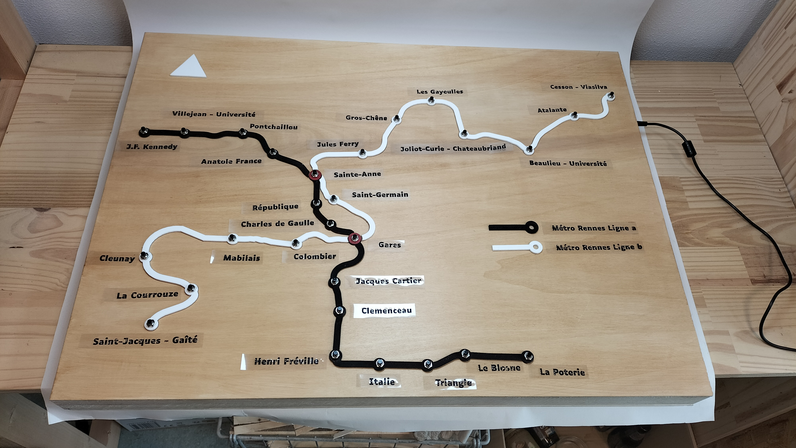

# OpenStreetTangible
OpenStreetTangible is a demonstration of what's possible in terms of accessible public transportation maps using OpenStreetTouch software, BrailleRAP, and various digital fabrication tools.

It's a tactile, talking metro map of the city of Rennes in France, Britanny, designed for people with visual impairments.

This prototype, used  [OpenStreetTouch] (https://github.com/braillerap/OpenStreetTouch/
releases) software to extract public transportation data and a [BrailleRAP] (https://github.com/braillerap) to emboss stickers in Braille.

## Building manual
The building manual is available here [https://openstreettangible.readthedocs.io/en/latest/](https://openstreettangible.readthedocs.io/en/latest/)

Translations are availables here :

**en** 

**fr** 

## Contributions

### Translation
If you need the software in your locale language, we will be happy to add a new translation. Translation files are hosted on codeberg community translation platform and can be updated by anyone [weblate host on codeberg](https://translate.codeberg.org/engage/openstreettangible_buildingmanual/) for more information.

### New cities 
Feel free to open issues or pull requests ! We will be happy to review and merge your changes, especialy if you want to build a tangible transport map of your city.

## Funding

This project is funded through [NGI0 Entrust](https://nlnet.nl/entrust), a fund established by [NLnet](https://nlnet.nl) with financial support from the European Commission's [Next Generation Internet](https://ngi.eu) program. Learn more at the [NLnet project page](https://nlnet.nl/project/BrailleRAP).

