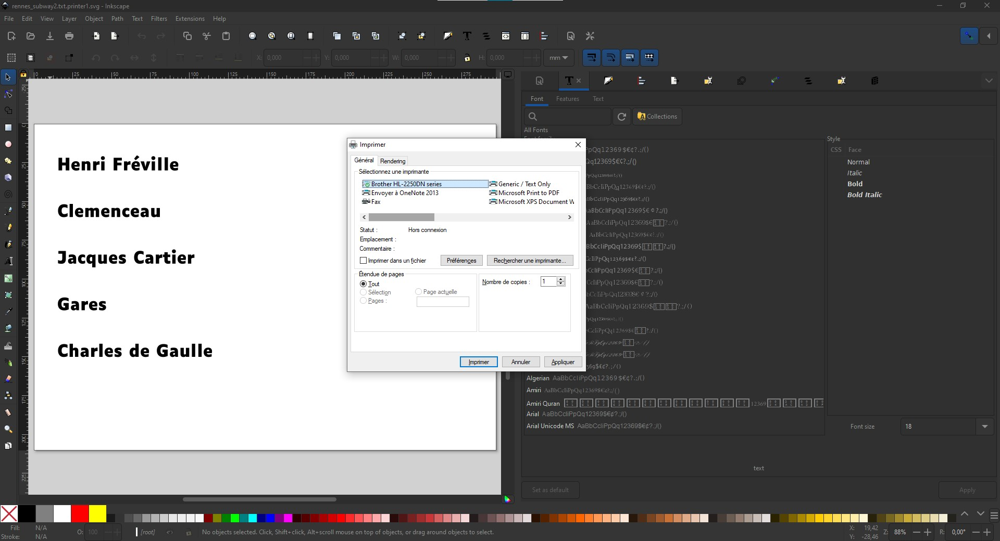
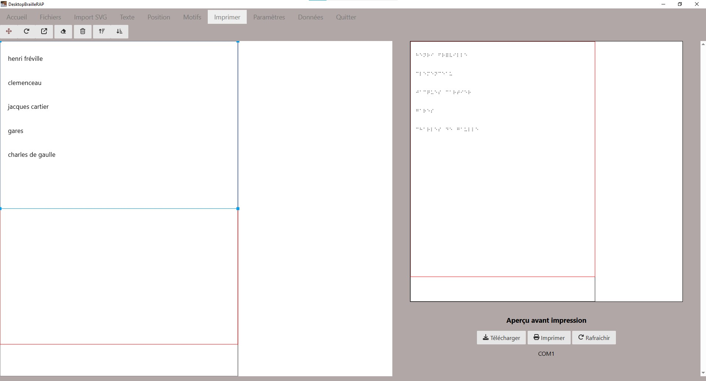
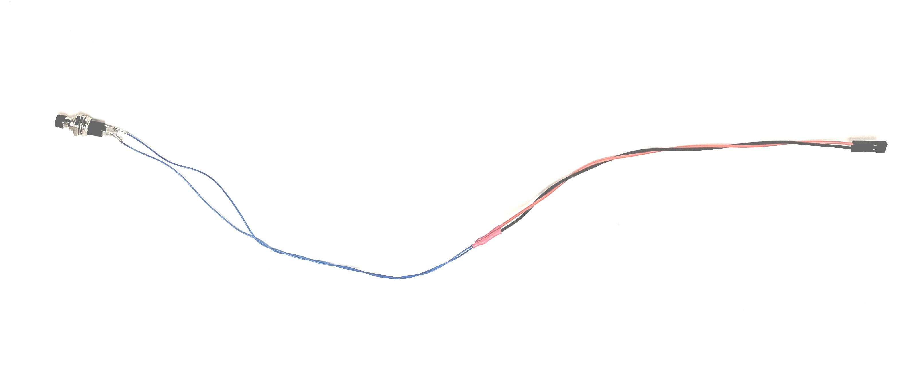
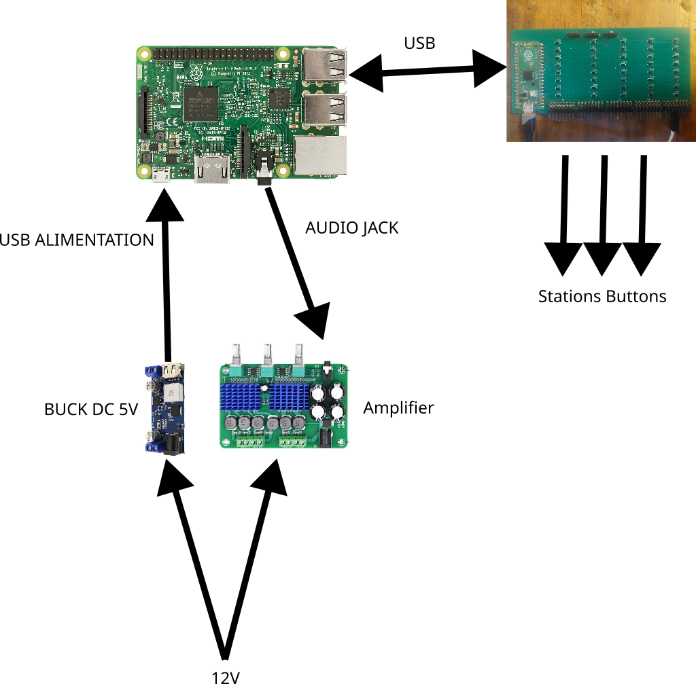

# Étapes de fabrication

## Liste du matériel

### Outillage
* Une [BrailleRAP](https://github.com/braillerap/BrailleRap).
* Découpe laser.
* imprimante laser (vous pouvez utiliser une imprimante jet d'encre en utilisant les feuilles transparentes adaptées)
* Perceuse.
* Fer à souder.
* Multimètre.
* Serre joints ou grosses pinces.


### Consommables

* Soudure pour électronique.
* fils de cablage.
* colle cyanoacrylate pour coller plexi sur bois
* colle à bois.
* bombe de peinture noire.
* bombe de peinture rouge.


### Réalisation du plan

* papier de verre (grammage 120).
* 2 plaques de contreplaqué de peuplier de 5mm d'épaisseur de 80 cm x 60cm. 
* 1 plaque de contreplaqué de peuplier 3mm pour découpe d’une ligne de métro (format adapté à la taille de la découpeuse laser) et légende.
* 1 plaque de PMMA blanc 3mm pour découpe d'une ligne de métro (format adapté à la taille de la découpeuse laser) et légende.
* 1 tasseau de 53,5cm (section 3x5cm).
* 1 tasseau de 41cm (section 3x5cm).
* 2 tasseaux de 80 cm (section 3x5cm).
* ~10 Feuilles transparentes pour impression laser pour les etiquettes de stations en noir et en Braille.
* 8 x inserts M6 x23mm. 
* 8 x Vis M6.


### Electronique

* Une raspberry pi version 2 ou supérieure 1GO de RAM est largement suffisant. Une Raspberry PI zero est surement utilisable mais il faut lui ajouter une sortie audio.
* carte clavier [shapeless_rp2040_40keys](https://github.com/crocsg/shapeless_rp2040_40keys).
* 2 cables micro USB, 1 pour l'alimentation du Raspberry, 1 pour la liaison shapeless_rp2040_40keys / raspberry pi.
* 30 boutons poussoir à souder, fixation par écrou (autant de boutons que de stations + la légende)
* fils de cablage pour connecter les boutons à la raspi (deux couleurs différentes, pour dissocier chaque ligne)
* connecteurs dupont femelle 2 fils pour la connexion des boutons à la carte shapeless_rp2040_40keys.
* ampli audio avec entrée mini jack.
* cable mini jack audio
* 1 Haut parleur 3~5 W
* Embase Alimentation jack 2.5mm. 
* Alimentation 12V 6A avec connecteur Jack 2.5mm.


## Partie logicielle : Open Street Touch & Inkscape

### Extraction des données de lignes de transport avec OpenStreetTouch
* Installer OpenStreetTouch et suivre le tutoriel associé pour extraire les données de transports qui vous intéressent.
 (https://openstreettouch.readthedocs.io/fr/latest/manuel_utilisateur.html) 

 Nous n'utiliserons pas l'option "polygones pour tracés de lignes", de manière a pouvoir manipuler les entités de façon fines avec le logiciel Inkscape.


* Dans le cas de la ville de Rennes, les lignes ont le même tracé dans les deux sens de circulation. Nous avons donc sélectionné chaque ligne une seule fois.
* Extraire l’ensemble des lignes de transport souhaitées sur un seul SVG. Ce fichier servira a réaliser un fichier pour la gravure du fond et la découpe des tracés de lignes.

* Extraire également le nom des stations pour chacune des lignes avec le bouton "Enregistrer les stations en TXT"


###  Transformation des fichiers avec Inkscape
Le SVG issu d'OpenStreetTouch doit être modifié avec un logiciel de dessin vectoriel comme Inkscape (logiciel libre et gratuit).

#### Mise à l'échelle du plan
*  Ouvrir le svg de l'ensemble des lignes avec Inkscape et mettre le SVG à l’échelle du plan choisi (redimensionner le document à la taille souhaitée)

  Fichier>propriétés du document 
  
  Ajuster la taille du document aux dimensions souhaitées (ici 800 x 600 mm)
  
  Sélectionner ensuite l'ensemble des lignes (CTL+A) et agrandir à la taille souhaitée pour s'ajuster au format du document. Penser a garder un peu de marge sur les bords (dans notre cas 50 mm).
  Ce fichier servira ensuite à la réalisation de :

  * Un fichier pour la gravure et le perçage de laplaque de fond. La gravure permettra d'avoir un repère pour le collage des lignes. Les percage permettront le passage des boutons qui sont vissés sur les lignes des stations.
  * Plusieurs fichiers pour la découpe de chaque ligne de métro.

####  Mise en forme du réseau

Pour des raisons esthétiques et pratiques non avons effectué les modifications suivantes :

* Les débuts et fin de lignes ont été remplacés par des cercles.
* Les cercles des stations sont redimensionnés a 15 mm de diamètre.
* La largeur des tracés de lignes est défini a 8 mm.
* Nous avons fusionné les stations avec correspondance. Parce que cela permet d'avoir un tracé de ligne plus evident quand on le suit au doigt. Pour la ville de Rennes, ce choix est assez évident. Cela permet également de distinguer les stations en correspondance avec un matériau, donc un touché différent.
* A proximité des stations en correspondance, nous avons espacé les lignes de transport pour obtenir un tracé moins ambigu au niveau des correspondances et conserver une largeur de ligne de 8mm.
* Quelques stations ont été légérement déplacée pour faciliter l'étiquetage Braille, cela ne change pas la géographie du réseau, cela permet juste d'éviter d'avoir des étiquettes trop proches les unes des autres.

Le fichier svg résultat est le suivant

*Fichier SVG "rennes_metro_worked2.svg" après ajustements pour la mise en forme du réseau*

#### Préparation du fichier pour la gravure et le percage de la plaque de fond

A partir du fichier **rennes_metro_worked2.svg** nous avons réalisé les opérations suivantes avec inkscape :

* Transformation des lignes en contour en respectant la largeur de trait de 8mm en sélectionnant chaque ligne et en utilisant la fonction `Path/Object to path`.
* Pour chaque station, ajout d'un cercle qui correspondra au percage de la station pour faire passer le bouton poussoir (trou de 10.7 mm)
* Transformation des stations en chemins en sélectionnant les cercles exterieures des stations et en utilisant la fonction `Path/Object to path`.
* Les lignes et les stations sont ensuite fusionnés en sélectionnant les stations et les lignes  et en utilisant la fonction `Path/Union`.
* Les lignes sont découpés au niveau des stations en correspondances avec la fonction `Path/difference`.

Pour réaliser la plaque de fond, les lignes noires correspondent à la gravure pour repérer la position des lignes, les lignes rouges correpondent aux découpes pour les boutons poussoirs.

Le fichier svg résultat est le suivant

*Fichier SVG  "rennes_subway_fond.svg" préparé pour la découpe laser pour procéder à la gravure et le perçage de la plaque de fond*

#### Préparation des fichiers pour la découpe des lignes

A partir du fichier *rennes_metro_worked2.svg* nous avons réalisé les opérations suivantes avec inkscape :

* Transformation des lignes en contour en respectant la largeur de trait de 8mm en sélectionnant chaque ligne et en utilisant la fonction `Path/Object to path`.
* Pour chaque station, ajout d'un cercle qui correspondra au percage de la station pour fixer le bouton poussoir (trou de 7 mm)
* Transformation des stations en cercle en sélectionnant les cercles exterieures des stations et en utilisant la fonction `Path/Object to path`.
* Les lignes et les stations sont ensuite fusionnés en sélectionnant les stations et les lignes  et en utilisant la fonction `Path/Union`.
* Les lignes sont découpés au niveau des stations en correspondances avec la fonction `Path/difference`.

Pour les lignes de transport, les lignes noires correspondent à des découpes extérieures, les lignes rouges correpondent aux découpes pour les boutons poussoirs. Pour chaque lignes ont regroupe les différentes parties pour optimiser l'utilisation du matériau.

Les fichiers svg résultats sont les suivants :

Pour la ligne A

*Fichier SVG de découpe de la ligne A*

Pour la ligne B

*Fichier SVG de découpe de la ligne B*

#### Réalisation à l'aide de la découpe laser

En utilisant le logiciel de la découpe laser, nous avons réalisé la plaque de fond en marquant les tracés en noir et en découpant les tracés en rouge sur une plaque de contreplaqué peuplier 5mm.

Les lignes A et B sont ensuite découpées en découpant les tracés rouges puis les tracés noirs. Chaque ligne est découpée dans un matériau différent, du PMMA blanc 3mm et du contreplaqué peuplier 3mm.

Pour la ligne en contreplaqué peuplier, nous avons utilisé le même fichier de découpe pour découper les lignes dans du papier de verre 120.


```{note} 
Ne pas enlever le plastique protecteur du PMMA. Le plastique de protection sera retiré juste avant le collage.
```


Une fois les éléments découpés, on effectue un test de mise en place sans collage.


### Fichier 3D à imprimer

Imprimer en PLA ou PETG :

* Panneau de fixation de l'embase d'alimentation **subwaycommande.stl**.
* 1 ou 2 passe cable pour organiser les cables **chemin_cable.stl**.
* 1 Support de Raspberry PI **support_rpi.stl**.

```{note} 
Les fichiers STL pour l'impression se trouvent dans le repertoire 3dprint.
```

### Préparation des étiquettes

La difficulté pour la réalisation des étiquettes est d'aligner suffisement bien l'impression, en gros caractères avec l'embossage Braille pour gagner de la place.

Pour réussir à aligner correctement l'impression et l'embossage, nous avons utilisé le script python dans le repertoire `labeltosvg`, ce script prend en entrée un fichier texte contenant une série de ligne à imprimer et génère une série de fichiers SVG numérotés pour l'impression standard et pour l'embossage sur BrailleRAP. 

Pour un numéro particulier, le fichier "xxxxxx.printer.svg" devra être imprimé avec une imprimante. Le fichier "xxxxxx.brap.svg" devra ensuite être embossé sur la BrailleRAP à l'aide du logiciel [DesktopBrailleRAP](https://github.com/braillerap/DesktopBrailleRAP).

Nous avons utlisé ce script python avec le fichier .txt des stations de transport généré par [OpenStreetTouch](https://github.com/braillerap/OpenStreetTouch)


Un exemple de fichier SVG pour l'impression


```{note} 
Les fichiers SVG pour la réalisation des étiquettes se trouvent dans le repertoire labels.
```


#### Réalisation des étiquettes
Ouvrir un des fichiers préparé à l'aide de `labeltosvg` avec inkscape et l'imprimer sur l'imprimante laser.

Capture d'écran d'un fichier d'étiquettes dans Inkscape.


Insérer la feuille préalablement imprimé dans la BrailleRAP, puis importer le fichier SVG correspondant avec DesktopBrailleRAP, et le positioner en 0,0. Puis lancer l'impression sur la BrailleRAP pour obtenir le Braille par dessus l'impression en noir. 

Capture d'écran du même fichier d'étiquettes dans DesktopBrailleRAP.



#### Découpe des étiquettes
- Découper ensuite les étiquettes ligne par ligne de préférence à l’aide d’un massicot sinon cutter ou ciseaux.
- Finaliser la découpe pour les séparer verticalement à l’aide d’un cutter ou de ciseaux en laissant toujours la même marge en début de mot et à la fin si possible


## Fabrication du plan de métro avec son chassis

### Peinture

Pour augmenter les contrastes, les lignes en papier de verre sont peintes en noir, les stations de correspondance sont peintes en rouge.

* Peindre à la bombe de couleur noire la ligne en papier de verre.
* Peindre à la bombe rouge les deux stations de correspondances

### Collage du papier de verre sur la ligne A

Coller la ligne A découpée dans le papier de verre sur sa ligne correspondante en bois avec de la colle à bois.

### Préparation du chassis du plan

* Mettre le plan 80 X 60 cm face gravée contre une table (propre !).

* Placer les tasseaux découpés à la bonne taille sur le cadre de la plaque. Dessiner au crayon à papier leur contour pour bien avoir le repère au moment du collage.

* Coller les tasseaux avec la colle à bois et les maintenir en place avec des pinces ou des serre-joints. Pour ne pas faire de marquage ou déformer les tasseaux avec les pinces et étaux, ajouter des plaques de protection entre le tasseau et la pince de serrage.
Procéder en plusieurs étapes si nécessaire en laissant sécher un minimum avant d'enlever les pinces et les serre-joints.


*Collage tasseaux*


*Collage tasseaux avec plaques de protection*


*Finalisation collage tasseaux*
|

* Percer 8 trous pour ajouter les inserts (1 à chaque coin et 1 entre chaque extrémité) sur les les tasseaux


*Plan global gravé et percé monté sur chassis avec inserts ajoutés pour le refermer par dessous*

### Vérification de l'assemblage avant le collage des lignes de métro
- Positionner les éléments des deux lignes pour vérifier que tous les éléments sont présents et correspondent bien au tracé de repérage.

### Collage des lignes de métro et des stations de correspondance

* Coller les deux lignes de métro découpées à la laser sur le plan

* Coller chacune des lignes en vous repérant à la gravure. Utiliser la colle à bois pour la ligne A en peuplier et la colle cyano pour la ligne B en PMMA (enlever la protection sur la face qui sera collée juste avant d’appliquer la colle . 

* Coller les cercles correspondant aux stations de correspondance ici peintes préalablement à la bombe de peinture rouge.


## Montage du circuit électronique
### Préparation des boutons
- Étamer les boutons
- Mesurer la longueur de fil nécessaire entre chaque emplacement de bouton (trous des stations) jusqu'à l'emplacement de la carte clavier . Enlever la longueur de fil des fils des connecteurs pour avoir la bonne longueur. Prévoir quelqus cm de plus
- Souder le fil intermédiaire (rallonge) entre le connecteur et le bouton comme sur cette photo en ajoutant de la gaine thermo sur les connections à la soudure


*Bouton sooudé avec le fil de rallonge et le connecteur*


- Préparer l'ensemble des boutons pour une ligne pour commencer en s'assurant d'avoir la même couleur de fil pour tous les boutons de cette ligne. On prendra une autre couleur pour la 2 e ligne.

*Ensemble des boutons péparé pour une ligne classé par ordre de dimension*

### Montage des boutons sur le plan
- Insérer la rondelle sur le bouton pour qu'elle se trouve sous la plaque. Insérer ensuite le bouton avec sa rondelle par dessous et le fixer à la main avec l'écrou sur le dessus de la plaque(sans serrer avec une clé pour commencer)
- Procéder ainsi pour tous les boutons de l'ensemble de la ligne


### Pré-positionnement des étiquettes et vérification de l'ensemble des éléments
- Positionner chaque étiquette face à la station correspondante en respectant une logique d'accessibilité au maximum pour sentir l'étiquette correspondante à la station au toucher. 
- Positionner aussi la légende et le triangle qui indique le nord


*Prépositionnement étiquettes, légendes et triangle pour indiquer le Nord*

Une fois validé la position des étiquettes, les retirer et les conserver dans une boîte avec les éléments de la légende et le triangle. 


### Schéma de principe du cablage

* Alimentation 12V => Buck DC 5V & Amplificateur
* Buck DC 5V USB => USB alimentation du Raspberry Pi
* Raspberry PI USB  => shapeless_rp2040_40keys
* Sortie audio raspi => entrée ligne Amplificateur 
* Amplificateur Sortie HP => Haut Parleur




### Positionner la carte clavier et la coller

* Retourner le plan et positionner de manière provisoire la carte clavier dans l'espace libre et assurez-vous que les connecteurs de chaque boutons puissent l'atteindre

*Prépositionnement carte clavier opur vérifier que chaque bouton puisse être connecté*


* Coller la carte clavier en ajoutant un cadre en bois que vous pouvez réaliser à la laser (sur la photo on a trouvé en récup quelque chose de convenable !) avec un pistolet à colle


### Connecter les connecteurs de chaque bouton à la carte clavier
- Connecter les connecteurs des boutons si possible dans l'ordre des stations de la ligne our faciliter le repérage mais ce n'est pas obligatoire!


