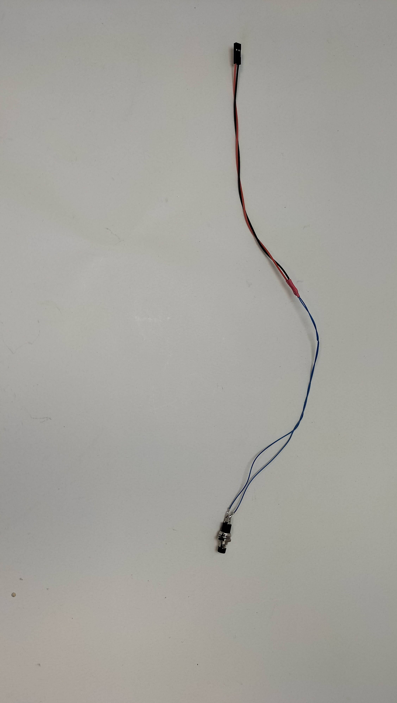
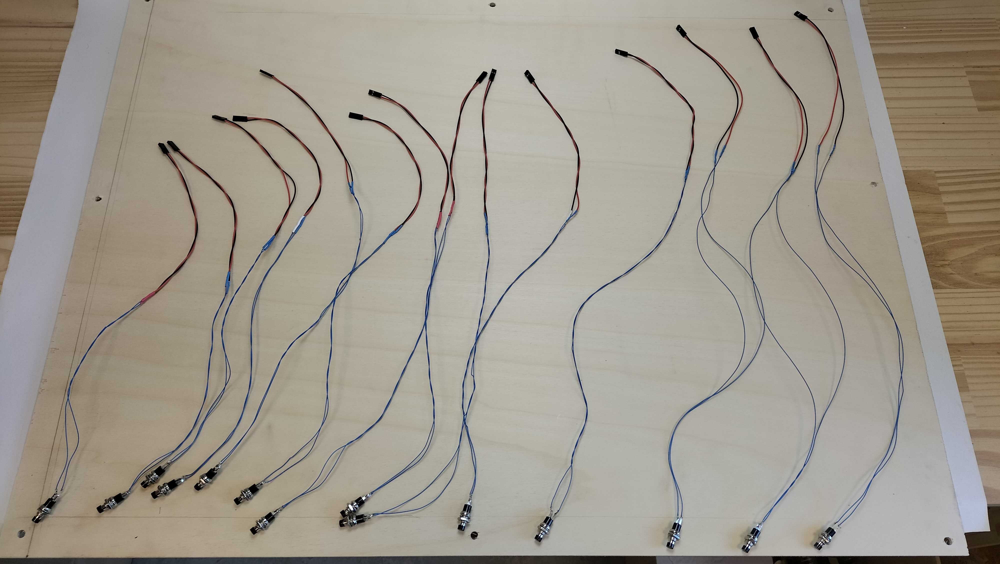

# Étapes de fabrication

## Liste du matériel

### Outillage
* Une [BrailleRAP](https://github.com/braillerap/BrailleRap).
* Découpe laser.
* imprimante laser (vous pouvez utiliser une imprimante jet d'encre en utilisant les feuilles transparentes adaptées)
* Perceuse.
* Fer à souder.
* Multimètre.
* Serre joints ou grosses pinces.

### Consommables

* Soudure pour électronique
* fils de cablage
* colle cyano pour coller plexi sur bois
* colle à bois
* bombe de peinture noire
* bombe de peinture rouge

### Réalisation du plan

* papier de verre (grammage 120)
* 2 plaques de contreplaqué de peuplier de 5mm d'épaisseur de 80 cm x 60cm 
* 1 plaque de contreplaqué de peuplier 3mm pour découpe d’une ligne de métro (format adapté à la taille de la découpeuse laser) et légende
* 1 plaque de PMMA blanc 3mm pour découpe d'une ligne de métro (format adapté à la taille de la découpeuse laser) et légende
* 1 tasseau de 53,5cm (section 3x5cm)
* 1 tasseau de 41cm (section 3x5cm)
* 2 tasseaux de 80 cm (section 3x5cm)
* ~10 Feuilles transparentes pour impression laser pour les etiquettes de stations en noir et en Braille.
* 8 x inserts M6 x23mm 
* 8 x Vis M6

### Electronique

* Une raspberry pi version 2 ou supérieure 1GO de RAM est largement suffisant. Une Raspberry PI zero est surement utilisable mais il faut lui ajouter une sortie audio.
* carte clavier [shapeless_rp2040_40keys](https://github.com/crocsg/shapeless_rp2040_40keys).
* 2 cables micro USB, 1 pour l'alimentation du Raspberry, 1 pour la liaison shapeless_rp2040_40keys / raspberry pi.
* 30 boutons poussoir a souder, fixation par écrou (autant de boutons que de stations + la légende)
* fils de cablage pour connecter les boutons à la raspi (deux couleurs différentes, pour dissocier chaque ligne)
* connecteurs dupont femelle 2 fil pour la connexion des boutons à la carte shapeless_rp2040_40keys.
* ampli audio avec entrée mini jack.
* cable mini jack audio
* 1 Haut parleur 3~5 W
* Embase Alimentation jack 2.5mm. 
* Alimentation 12V 6A avec connecteur Jack 2.5mm.

## Partie logicielle : Open Street Touch & Inkscape

### 1-Extraction des données de lignes de transport avec OpenStreetTouch
* Installer OpenStreetTouch et suivre le tutoriel associé pour extraire les données de transports qui vous intéressent.
 (https://openstreettouch.readthedocs.io/fr/latest/manuel_utilisateur.html) 

 Nous n'utiliserons pas l'option "polygones pour tracés de lignes", de manière a pouvoir manipuler les entités de façon fines avec le logiciel inkscape.

* Dans le cas de la ville de Rennes, les lignes ont le même tracé dans les deux sens de circulation. Nous avons donc sélectionné chaque ligne une seule fois.
* Extraire l’ensemble des lignes de transport souhaitées sur un seul SVG. Ce fichier servira a réaliser un fichier pour la gravure du fond et la découpe des tracés de lignes.

* Extraire également le nom des stations pour chacune des lignes avec le bouton "Enregistrer les stations en TXT"

###  Transformation des fichiers avec Inkscape
Le SVG issue d'OpenStreetTouch doit être modifié avec un logiciel de dessin vectoriel comme Inkscape (logiciel libre et gratuit).

#### Mise à l'échelle du plan
*  Ouvrir le svg de l'ensemble des lignes avec Inkscape et mettre le SVG à l’échelle du plan choisi (redimensionner le document à la taille souhaitée)

  Fichier>propriétés du document 
  
  Ajuster la taille du document aux dimensions souhaitées (ici 800 x 600 mm)
  
  Sélectionner ensuite l'ensemble des lignes (CTL+A) et agrandir à la taille souhaitée pour s'ajuster au format du document. Penser a garder un peu de marge sur les bords (dans notre cas 50 mm).
  Ce fichier servira ensuite à la réalisation de :

  * Un fichier pour la gravure et le perçage de laplaque de fond. La gravure permettra d'avoir un repère pour le collage des lignes. Les percage permettront le passage des boutons qui sont vissés sur les lignes des stations.
  * Plusieurs fichiers pour la découpe de chaque ligne de métro.

####  Mise en forme du réseau

Pour des raisons esthétiques et pratiques non avons effectué les modifications suivantes :

* Les débuts et fin de lignes ont été remplacés par des cercles.
* Les cercles des stations sont redimensionnés a 15 mm de diamètre.
* La largeur des tracés de lignes est défini a 8 mm.
* Nous avons fusionné les stations avec correspondance. Parce que cela permet d'avoir un tracé de ligne plus evident quand on le suit au doigt. Pour la ville de Rennes, ce choix est assez évident. Cela permet également de distinguer les stations en correspondance avec un matériaux, donc un touché différent.
* A proximité des stations en correspondance, nous avons espacé les lignes de transport pour obtenir un tracé moins ambigu au niveau des corresponances et conserver une largeur de ligne de 8mm.
* Quelques stations ont été légérement déplacée pour faciliter l'étiquetage Braille, cela ne change pas la géographie du réseau, cela permet juste d'éviter d'avoir des etiquettes trop proches les unes des autres.

Le fichier svg résultat est le suivant

#### Préparation du fichier pour la gravure et le percage de la plaque de fond

A partir du fichier rennes_metro_worked2 nous avons réalisé les opérations suivantes avec inkscape :

* Transformation des lignes en contour en respectant la largeur de trait de 8mm en sélectionnant chaque ligne et en utilisant la fonction Path/Object to path.
* Pour chaque station, ajout d'un cercle qui correspondra au percage de la station pour faire passer le bouton poussoir (trou de 10.7 mm)
* Transformation des stations en cercle en sélectionnant les cercles exterieures des stations et en utilisant la fonction Path/Object to path.
* Les lignes et les stations sont ensuite fusionnés en sélectionnant les stations et les lignes  et en utilisant la fonction Path/Union.
* Les lignes sont découpés au niveau des stations en correspondances avec la fonction Path/difference.

Pour réaliser la plaque de fond, les lignes noires correspondent à la gravure pour repérer la position des lignes, les lignes rouges correpondent aux découpes pour les boutons poussoirs.

Le fichier svg résultat est le suivant

#### Préparation des fichiers pour la découpe des lignes

A partir du fichier *rennes_metro_worked2.svg* nous avons réalisé les opérations suivantes avec inkscape :

* Transformation des lignes en contour en respectant la largeur de trait de 8mm en sélectionnant chaque ligne et en utilisant la fonction `Path/Object to path`.
* Pour chaque station, ajout d'un cercle qui correspondra au percage de la station fixer le bouton poussoir (trou de 7 mm)
* Transformation des stations en cercle en sélectionnant les cercles exterieures des stations et en utilisant la fonction `Path/Object to path`.
* Les lignes et les stations sont ensuite fusionnés en sélectionnant les stations et les lignes  et en utilisant la fonction `Path/Union`.
* Les lignes sont découpés au niveau des stations en correspondances avec la fonction `Path/difference`.

Pour les lignes de transport, les lignes noires correspondent à des découpes extérieures, les lignes rouges correpondent aux découpes pour les boutons poussoirs. Pour chaque lignes ont regroupe les différentes parties pour optimiser l'utilisation du matériau.

Les fichiers svg résultats sont les suivants :

Pour la ligne A

Pour la ligne B

#### Réalisation à l'aide de la découpe laser

En utilisant le logiciel de la découpe laser, nous avons réalisé la plaque de fond en marquant les tracé en noir et en découpant les tracés en rouge sur une plaque de contreplaqué peuplier 5mm.

Les lignes A et B sont ensuite découpées en découpant les tracés rouges puis les tracés noirs. Chaque ligne est découpées dans un matériau différents, du PMMA blanc 3mm et du contreplaqué peuplier 3mm.

Pour la ligne en contreplaqué peuplier, nous avons utilisé le même fichier de découpe pour découper les lignes dans du papier de verre 120.

[!IMPORTANT]  
Ne pas enlever le plastique protecteur du PMMA. Le plastique de protection sera retiré juste avant le collage.

Une fois les éléments découpés, on effectue un test de mise en place sans collage.

### Fichier 3D à imprimer
Imprimer en PLA ou PETG :
* Panneau de fixation de l'embase d'alimentation *subwaycommande.stl*.
* 1 ou 2 passe cable pour organiser les cables *chemin_cable.stl*.
* 1 Support de Raspberry PI *support_rpi.stl*

### Préparation des étiquettes

#### Préparation des fichier

 * redimensionner la taille de la police sur 24 pts.
 * Définir la police Luciole.
 * Remettre en page les noms de manière à ce qu’ils ne soient pas coupés.
 * Laisser un espace entre chaque ligne. 

TO DO : mettre le fichier exemple sur lequel nous avons travaillés.

#### Impression des noms sur les étiquettes
Une fois prêt , imprimer en noir avec l’imprimante laser le fichier sur du papier Rhoidoïde (papier plastique transparent généralement utilisé pour les rétroprojecteurs. Prévoir de les faire en double ou triple au cas où il y ait des ratés ...

Effectuer la configuration des marges avant de faire l’impression des caractères en noir sur l’imprimante laser. (TO DO: Préciser quelle marge et quels réglages ont été fait fait pour l'impression)

Attention il ne faut pas faire les impressions sur une imprimante qui n’est pas laser au risque d’endommager la machine !! Il est impératif de le faire sur une imprimante laser. 

#### Impression brailles
Une fois les noms imprimés sur le rhodoïde , préparer l’impression en braille avec les consignes suivante : 

- Dans le logiciel AccessBrailleRap, ajuster les marges de manière à ce que le braille se cale sur le nom imprimé en noir. Cette étape est un peu délicate et nécessite des ajustements en faisant des tests préalables.
Pour notre cas, nous avons cette configuration (TO DO : impression écran de la config ou explications sur la manip pour le calage)

- Quand le calage est satisfaisant, on peut alors lancer l’embossage avec la machine braillerap sur les rhodoïdes préparés.

#### Découpe des étiquettes
- Découper ensuite les étiquettes ligne par ligne de préférence à l’aide d’un massicot sinon cutter ou ciseaux.
- Finaliser la découpe pour les séparer verticalement à l’aide d’un cutter ou de ciseaux en laissant toujours la même marge en début de mot et à la fin si possible

## Fabrication du plan de métro avec son chassis

### Fichiers sources extraits d’open street map et retravaillés dans Inkscape
- l'ensemble du plan de métro retravaillé (les deux lignes : ligne A et ligne B) sur un seul fichier (à graver)
- les deux lignes de métro sur des fichiers séparés : les deux lignes redécoupées en plusieurs parties sur les jonctions de stations de correspondance
- les deux stations de correspondance :
- les deux légendes : 
- le fichier avec les noms des stations écrit en 24 points police Arial black ou Luciole : 

### Préparation des éléments pour la découpe laser

**Plan d'ensemble**

Importer le fichier global retravaillé  représentant les deux lignes de métro, sur le logiciel de la découpe laser. 

Créer deux calques pour travailler sur le fichier. L’un sert pour graver le contour des lignes servant de référence pour le collage, et l’autre sert à découper les cercles des stations.

Graver le contour de l’ensemble du plan des deux lignes de métros sur la grande plaque de 80 x60cm avec le SVG correspondant, et couper les cercles internes (stations, légendes) prévus pour y insérer les boutons. 

Sur la photo ci-dessous, nous avions oublié de faire les trous pour placer les boutons sur la légende lors de la découpe laser. Nous ferons les trous à la perceuse ce qui nous permet aussi de positionner la légende là où cela nous arrange en fonction du positionnement du circuit électronique sur l'envers de la plaque.

 

**Découpe des lignes de transport**

Découper ensuite chaque ligne de métro redécoupée en plusieurs parties numériquement (dans Inkscape) (cf:transformation des fichiers) sur  leur matériau respectif (Peuplier 3mm et PMMA blanc 3mm). Préférer la ligne la plus courte ou la plus simple pour le matériau bois/papier de verre puisqu’elle nécessite plus de travail. Pour notre cas, nous choisissons la ligne A. (JF Kennedy-Poterie)

To do : ajouter photos 

Découper ensuite le papier de verre à la découpe laser avec les fichiers de la ligne A qui a déjà été  découpé sur le peuplier 3 mm

**Découpe des stations de correspondance et des légendes**

Découper les stations de correspondance qui ont un cercle externe légèrement agrandi dans du peuplier 5mm. ***(ajouter diamètre)***

Découper également la légende pour les deux lignes. (une avec le papier de verre collé sur le bois et l’autre en PMMA)

### Peinture

Pour augmenter les contrastes, les lignes en papier de verre sont peintes en noir, les stations de correspondance sont peintes en rouge.

* Peindre à la bombe de couleur noire la ligne en papier de verre.
* Peindre à la bombe rouge les deux stations de correspondances

### Collage du papier de verre sur la ligne A

Coller la ligne découpée dans le papier de verre sur sa ligne correspondante en bois (ligne A) avec la colle à bois

### Préparation du chassis du plan

* Mettre le plan 80 X 60 face gravée contre une table (propre !).

* Placer les tasseaux découpés à la bonne taille sur le cadre de la plaque. Dessiner au crayon à papier leur contour pour bien avoir le repère au moment du collage

* Coller les tasseaux avec la colle à bois et les maintenir en place avec des pinces ou des serre-joints. Pour ne pas faire de marquage ou déformer les tasseaux avec les pinces et étaux, ajouter des plaue de protection entre le tasseau et la pince de serrage.
Procéder en plusieurs étapes si nécessaire en laissant sécher un minimum avant d'enlever les pinces et les serre-joints.

* Percer 8 trous pour ajouter les inserts (1 à chaque coin et 1 entre chaque extrémité)

 
 

### Vérification assemblage avant le collage des lignes de métro
- Positionner les éléments des deux lignes pour vérifier que tous les éléments sont présents et correspondent bien au tracé de repérage.

### Collage des lignes de métro

* Coller les deux lignes de métro découpées à la laser sur le plan

* Coller ensuite chacune des lignes en vous repérant à la gravure. Utiliser la colle à bois pour la ligne A en peuplier et la colle cyano pour la ligne B en PMMA (enlever la protection sur la face qui sera collée juste avant d’appliquer la colle . 

* Coller ensuite les cercles correspondant aux stations de correspondance  ici peintes à la bombe de peinture rouge.

### Assemblage et collage des deux lignes et des deux stations de correspondance sur le plan
- Avec la colle cyano, coller la ligne B en PMMA. 
- Avec la colle à bois coller la ligne A préparée avec le papier de verre peint en noir

## Montage du circuit électronique
### Préparation des boutons
- Étamer les boutons
- Mesurer la longueur de fil nécessaire entre chaque emplacement de bouton (trous des stations) jusqu'à l'emplacement de la carte clavier . Enlever la longueur de fil des fils des connecteurs pour avoir la bonne longueur. Prévoir quelqus cm de plus
- Souder le fil intermédiaire (rallonge) entre le connecteur et le bouton comme sur cette photo.

- Préparer l'ensemble des boutons pour une ligne pour commencer en s'assurant d'avoir la même couleur de fil pour tous les boutons de cette ligne. On prendra une autre couleur pour la 2 e ligne.

### Montage des boutons sur le plan
- Insérer la rondelle sur le bouton pour qu'elle se trouve sous la plaque . Insérer ensuite le bouton avec sa rondelle par dessous et le fixer à la main (sans clé pour commencer)
- Procéder ainsi pour tous les botuons de l'ensemble de la ligne

### Pré-positionnement des étiquettes et vérification de l'ensemble des éléments
- Positionner chaque étiquette face à la station correspondante en respectant une logique d'accessibilité au maximum pour sentir l'étiquette correspondante à la station au toucher. 
- Positionner aussi la légende et le triangle qui indique le nord

Une fois validé la position des étiquettes, les retirer et les conserver dans une boîte avec les éléments de la légende et le triangle.

### Positionner la carte clavier et la coller
- Retourner le plan et positionner de manière provisoire la carte clavier dans l'espace libre et assurez-vous que les connecteurs de chaque boutons puissent l'atteindre 
- Coller la carte clavier en ajoutant un cadre en bois que vous pouvez réaliser à la laser (sur la photo on a trouvé en récup quelque chose de convenable !

### Connecter les connecteurs de chaque bouton à la carte clavier
- Connecter les connecteurs des boutons si possible dans l'ordre es stations de la ligne

### Plan fritzing du schéma électronique
Alimentation 12V => régulateur de tension 5V (?, quelle ref ?) => Raspi (version?)
Raspi USB vers Clavier (ref) =>connecteurs boutons (Type câble?)
Sortie audio raspi vers Ampli (ref?) (Type câble ?)
Alimentation 12V (ampérage?)  => Ampli=>Speaker

### Montage sur l'envers de la plaque du plan de métro

